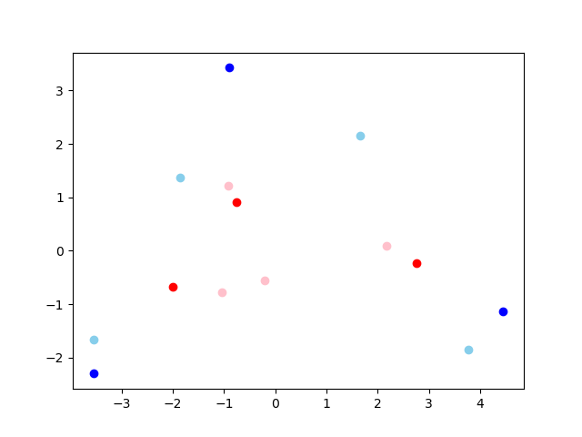
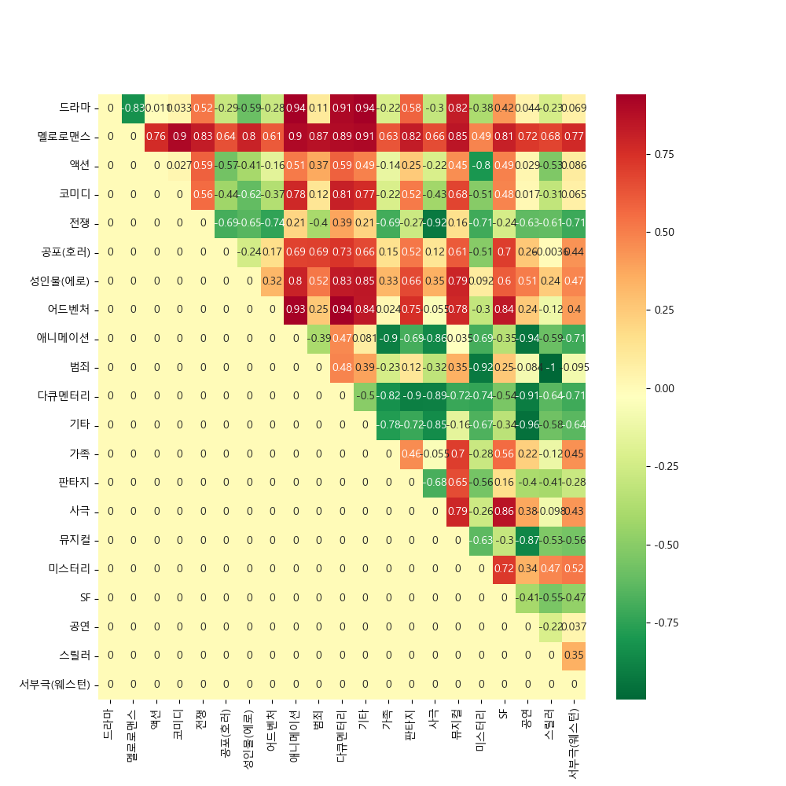
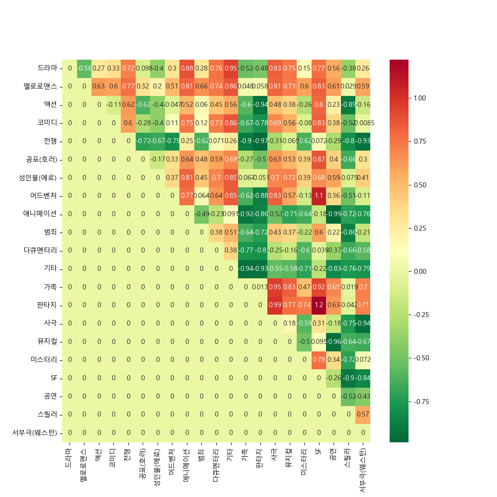

## 노드 7 - 워드 임베딩 (run_word-embedding.py)

- okt 토큰화
- keras 토큰화
- nltk abc
- Word2Vec, FastText, GloVe

## 노드 8,9 - 임베딩 내 편향성 알아보기

### 모듈 (weat.py)

클래스
- SynopsisWEAT

일반 함수
- cos_sim()
- weat_score()
- read_token()
- plot_heatmap()

### WEAT 구현 (run_weat.py)

- target_X: 장미,튤립,백합,데이지 (파란색)
- target_Y: 거미,모기,파리,메뚜기 (빨간색)
- attribute_A: 사랑,행복,웃음 (하늘색)
- attribute_B: 재난,고통,증오 (분홍색)

PCA 산점도 결과:



### KOBIS 영화 시놉시스 분석 (run_synopsis.py)

함수를 하나씩 실행할 경우:
```python
syweat = SynopsisWEAT()
syweat.set_model(model.wv)
syweat.make_target(targets)  # [art, gen]
syweat.make_excluded_words()
syweat.make_attributes(attributes, genre_name)
syweat.make_matrix()
```

한번에 실행할 경우:
```python
syweat = SynopsisWEAT()
syweat.process(model.wv, targets, attributes, genre_name)
```

결과 Heatmap:
```python
ax = plot_heatmap(syweat.matrix, genre_name)
```



중복 단어 삭제 후 결과:


