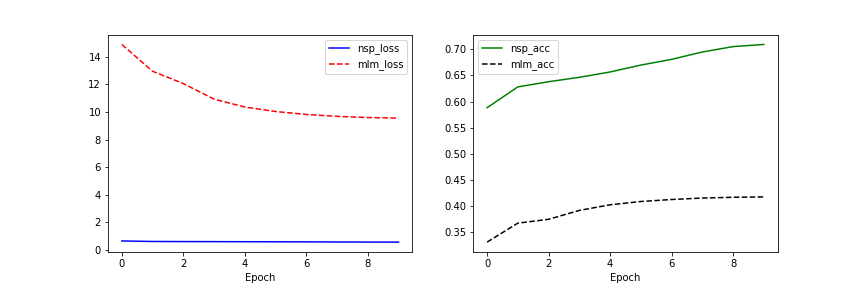

## Process - run_bert.py

- Preprocessing
	- get_vocab() - SentencePiece
	- get_dataset() - Mask, NSP pair
- Process
	- process() - building a model, training
- Result
	- plot_history() - nsp/mlm loss, nsp/mlm accuracy


## Modules

### Preprocessing - preprocess.py

### BERT model - bert.py


## Results



```
Model: "model_1"
__________________________________________________________________________________________________
Layer (type)                    Output Shape         Param #     Connected to                     
==================================================================================================
enc_tokens (InputLayer)         [(None, None)]       0                                            
__________________________________________________________________________________________________
segments (InputLayer)           [(None, None)]       0                                            
__________________________________________________________________________________________________
bert (BERT)                     ((None, 256), (None, 4485632     enc_tokens[0][0]                 
                                                                 segments[0][0]                   
__________________________________________________________________________________________________
pooled_nsp (PooledOutput)       (None, 2)            66304       bert[0][0]                       
__________________________________________________________________________________________________
nsp (Softmax)                   (None, 2)            0           pooled_nsp[0][0]                 
__________________________________________________________________________________________________
mlm (Softmax)                   (None, None, 8007)   0           bert[0][1]                       
==================================================================================================
Total params: 4,551,936
Trainable params: 4,551,936
Non-trainable params: 0
__________________________________________________________________________________________________
train_steps: 20000
Epoch 1/10
2000/2000 [==============================] - 250s 123ms/step - loss: 15.5390 - nsp_loss: 0.6526 - mlm_loss: 14.8864 - nsp_acc: 0.5881 - mlm_lm_acc: 0.3297

Epoch 00001: mlm_lm_acc improved from -inf to 0.32970, saving model to bert_prj_8k.hdf5
Epoch 2/10
2000/2000 [==============================] - 246s 123ms/step - loss: 13.5583 - nsp_loss: 0.6146 - mlm_loss: 12.9437 - nsp_acc: 0.6281 - mlm_lm_acc: 0.3662

Epoch 00002: mlm_lm_acc improved from 0.32970 to 0.36615, saving model to bert_prj_8k.hdf5
Epoch 3/10
2000/2000 [==============================] - 247s 124ms/step - loss: 12.6591 - nsp_loss: 0.6079 - mlm_loss: 12.0512 - nsp_acc: 0.6380 - mlm_lm_acc: 0.3736

Epoch 00003: mlm_lm_acc improved from 0.36615 to 0.37355, saving model to bert_prj_8k.hdf5
Epoch 4/10
2000/2000 [==============================] - 247s 123ms/step - loss: 11.5271 - nsp_loss: 0.6034 - mlm_loss: 10.9237 - nsp_acc: 0.6465 - mlm_lm_acc: 0.3907

Epoch 00004: mlm_lm_acc improved from 0.37355 to 0.39067, saving model to bert_prj_8k.hdf5
Epoch 5/10
2000/2000 [==============================] - 247s 123ms/step - loss: 10.9517 - nsp_loss: 0.5983 - mlm_loss: 10.3533 - nsp_acc: 0.6568 - mlm_lm_acc: 0.4014

Epoch 00005: mlm_lm_acc improved from 0.39067 to 0.40142, saving model to bert_prj_8k.hdf5
Epoch 6/10
2000/2000 [==============================] - 247s 124ms/step - loss: 10.6201 - nsp_loss: 0.5920 - mlm_loss: 10.0281 - nsp_acc: 0.6700 - mlm_lm_acc: 0.4078

Epoch 00006: mlm_lm_acc improved from 0.40142 to 0.40776, saving model to bert_prj_8k.hdf5
Epoch 7/10
2000/2000 [==============================] - 247s 123ms/step - loss: 10.4012 - nsp_loss: 0.5857 - mlm_loss: 9.8155 - nsp_acc: 0.6810 - mlm_lm_acc: 0.4116

Epoch 00007: mlm_lm_acc improved from 0.40776 to 0.41161, saving model to bert_prj_8k.hdf5
Epoch 8/10
2000/2000 [==============================] - 247s 123ms/step - loss: 10.2550 - nsp_loss: 0.5782 - mlm_loss: 9.6768 - nsp_acc: 0.6952 - mlm_lm_acc: 0.4144

Epoch 00008: mlm_lm_acc improved from 0.41161 to 0.41439, saving model to bert_prj_8k.hdf5
Epoch 9/10
2000/2000 [==============================] - 247s 123ms/step - loss: 10.1644 - nsp_loss: 0.5718 - mlm_loss: 9.5926 - nsp_acc: 0.7056 - mlm_lm_acc: 0.4159

Epoch 00009: mlm_lm_acc improved from 0.41439 to 0.41591, saving model to bert_prj_8k.hdf5
Epoch 10/10
2000/2000 [==============================] - 247s 123ms/step - loss: 10.1212 - nsp_loss: 0.5686 - mlm_loss: 9.5526 - nsp_acc: 0.7097 - mlm_lm_acc: 0.4166

Epoch 00010: mlm_lm_acc improved from 0.41591 to 0.41659, saving model to bert_prj_8k.hdf5
```
